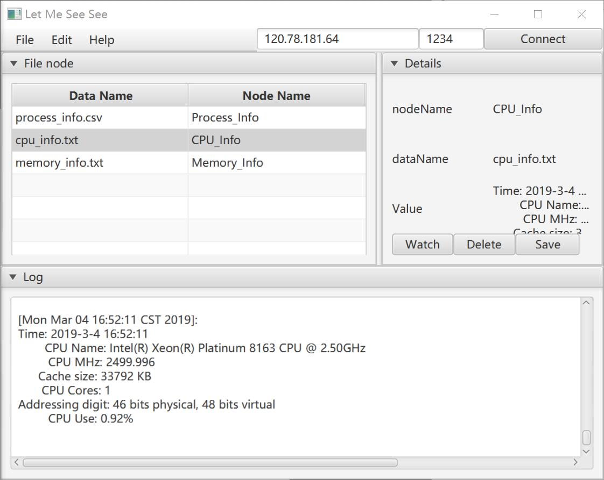

# LetMeSeeSee <a href="http://www.kernel.org"></a> [](https://travis-ci.com/zxc479773533/LetMeSeeSee)

[English](https://github.com/zxc479773533/LetMeSeeSee) | [中文](https://github.com/zxc479773533/LetMeSeeSee/blob/master/README_CN.md)

## About

<div align="center">
  
</div>

**LetMeSeeSee** is an efficient and easy-to-use remote file storage tool designed for `Linux C++` developers and maintainers. It includes a server-side remote data storage library developed by `C++` and a client supporting `Windows/Linux/MacOS` developed by `Java`.

**LetMeSeeSee** is dedicated to solving the problem of server development and maintenance personnel running from the remote monitoring program. Every time data storage and error checking is performed, there is no need to recompile the program, modify the configuration, restart the software, and only need to configure all at the beginning, and the client sends a storage request to the corresponding storage node to obtain remote data.

You can use our library in your server code to launch a remote service with just three lines of code. The data storage function is automatically generated by the macro we provide. See the Usage section for specific instructions. In addition, we also provide a `example`, a remote system monitor developed using the `LetMeSeeSee` library for your reference.

## Install

Please execute the following commands in order to complete the installation:

```shell
git clone https://github.com/zxc479773533/LetMeSeeSee.git
cd LetMeSeeSee
```

## Installing server library

### Dependencies

我们建议您使用`3.10`以上版本的`CMAKE`工具和`7.0`以上版本的`gcc`来获得更好的使用编译体验。这并不意味着不满足版本要求的环境下无法使用本工具，但低版本的编译工具在某些环境中有可能会引发些许我们意料之外的错误。

### Install

请按顺序执行以下命令完成安装：

```shell
git clone https://github.com/zxc479773533/LetMeSeeSee.git
cd LetMeSeeSee
cd src/server
mkdir build
cd build
cmake ..
make
sudo make install
```

## Usage

### Server

下面是`lmss::Storager`类的接口说明：

```c++
class Storager {
  public:
    // 根据启动网络服务，监听参数中的IP地址和端口
    void ListenAndServe(const std::string &ip, uint16_t port);
    // 扫描源码，并将所有数据储存节点转换为json格式保存
    void ScanSourceCode(const std::string &path);
    // 设置日志文件，如果不调用该函数，默认为std::clog，如果参数为空则不打印日志
    void SetLogFile(const std::string &filename);
  };
```

一个使用`LetMeSeeSee`开发的应用范例如下：([example/src/RemoteSysMonitor.cpp](example/src/RemoteSysMonitor.cpp))

这里选取部分片段进行说明。

```c++
// 引入 LetMeSeeSee 的头文件
#include <LetMeSeeSee/storager.h>

// Store 宏，参数1为存储节点名称，参数2为存储数据文件名
Store(Process_Info, process_info.csv) {
  std::string SaveFile = "../data/process_info.csv"; // 设置服务器上数据存储的路径

  // 执行你的存储操作

  return SaveFile; // 返回存储文件路径
}

int main(int argc, char **argv) {
  // 使用 Storager
  lmss::Storager storager;

  // 扫描源码，并将所有数据储存节点转换为json格式保存
  storager.ScanSourceCode("../src");

  // 启动网络服务，监听1234端口
  storager.ListenAndServe("0.0.0.0", 1234);

  pylib::Clock timer;
  while (true) {
  
    // 进行你的操作
  
  }
}
```

您需要在您的工程中按上面示例加上这些代码，即可轻松在您的项目中加入`LetMeSeeSee`的全部功能。

### Example

示例程序为一个远程系统监视器，您可以执行以下命令安装：

```shell
cd example
mkdir build
cd build
cmake ..
make
```

在运行`RemoteSM`时，在后面加上不同的参数以启用如下功能：

```txt
Usage: ./RemoteSM [Options]
Options:
  --source  <dir> : Specify source directory [Required]
  --datadir <dir> : Specify the savedata directory [Required]"
  --logfile <dir> : Specify the log output directory"
  --local  <freq> : Store data by frequency"
```

### Clinet

我们还提供了一个基于`Java`开发的一个配套客户端，您可以在[release](https://github.com/zxc479773533/LetMeSeeSee/releases)内下载最新版本。

<div align="center">
  
</div>

客户端可以通过输入服务端的`IP地址`和`端口号`来和服务端建立连接，获取数据存储节点，并对相应的节点请求数据存储。

服务端最大允许同时接入20个客户端。

## Developers

* [zxcpyp](https://github.com/zxc479773533)
  * Product Manage
  * Server Development
  * UI&Logo Design
* [金修旭](https://github.com/jyxk)
  * Clinet Development
* [Lab-Zjt](https://github.com/Lab-Zjt)
  * Server Development & Maintenance

We will continue to maintain this project and may update or reproduce the client in the future.

Copyright (c) 2018 zxcpyp, 金修旭, Lab-Zjt

Updated at 2019-03-04[每次更新了在这里写上精确到天的时间]