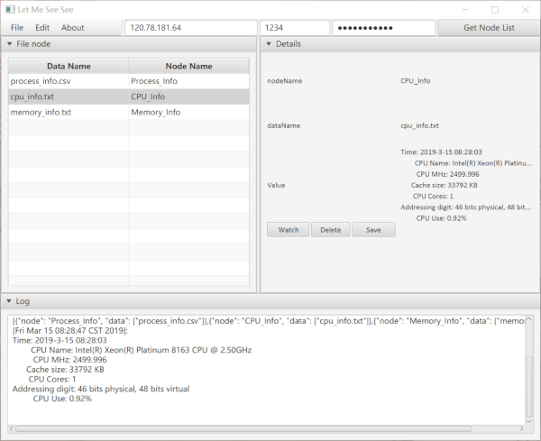

# LetMeSeeSee <a href="http://www.kernel.org"></a> [](https://travis-ci.com/zxc479773533/LetMeSeeSee)

[English](https://github.com/zxc479773533/LetMeSeeSee) | 中文

## About

<div align="center">
  
</div>

**LetMeSeeSee** 是一款专为`Linux C++`开发人员和维护人员设计的，高效率的、使用便捷的远程文件存储工具，它包含由`C++`开发的服务端远程数据存储库和一个配套的由`Java`开发的支持`Windows/Linux/MacOS`的客户端。

**LetMeSeeSee** 致力于解决服务端开发和维护人员从远端监视程序运行的问题，每次进行数据存储并查错时无需重新编译程序、修改配置、重启软件，只需要在一开始配置好所有的存储节点，由客户端对相应的存储节点发出存储请求来获取远端数据。

您可以在您的服务端程序代码中使用我们提供的库，只需加入三行代码，即可启动远程服务。而数据存储函数则由我们提供的宏来自动生成，具体的使用说明见Usage部分。此外，我们还提供了一个`example`，是利用`LetMeSeeSee`库开发的一个远程系统监视器，供您使用时进行参考。

## Installing server library

### Dependencies

#### Server

我们建议您使用`3.10`以上版本的`CMAKE`工具和`7.0`以上版本的`gcc`来获得更好的使用编译体验。这并不意味着不满足版本要求的环境下无法使用本工具，但低版本的编译工具在某些环境中有可能会引发些许我们意料之外的错误。

#### Clinet

建议安装`Java 8`环境，更高的版本需要手动安装`Javafx`包。

### Install

请按顺序执行以下命令完成安装：

```shell
git clone https://github.com/zxc479773533/LetMeSeeSee.git
cd LetMeSeeSee
cd src/server
mkdir build
cd build
cmake ..
make
sudo make install
```

## Usage

### Server

下面是`lmss::Storager`类的接口说明：

```c++
class Storager {
  public:
    // 根据启动网络服务，监听参数中的IP地址和端口
    void ListenAndServe(const std::string &ip, uint16_t port);
    // 扫描源码，并将所有数据储存节点转换为json格式保存
    void ScanSourceCode(const std::string &path);
    // 设置日志文件，如果不调用该函数，默认为std::clog，如果参数为空则不打印日志
    void SetLogFile(const std::string &filename);
    // 设置密码，如果不设置或者设置为空，则允许任何用户连接。
    void SetPassword(const std::string& password);
  };
```

一个使用`LetMeSeeSee`开发的应用范例如下：([example/src/RemoteSysMonitor.cpp](example/src/RemoteSysMonitor.cpp))

这里选取部分片段进行说明。

```c++
// 引入 LetMeSeeSee 的头文件
#include <LetMeSeeSee/storager.h>

// Store 宏，参数1为存储节点名称，参数2为存储数据文件名
Store(Process_Info, process_info.csv) {
  std::string SaveFile = "../data/process_info.csv"; // 设置服务器上数据存储的路径

  // 执行你的存储操作

  return SaveFile; // 返回存储文件路径
}

int main(int argc, char **argv) {
  // 使用 Storager
  lmss::Storager storager;

  // 扫描源码，并将所有数据储存节点转换为json格式保存
  storager.ScanSourceCode("../src");

  // 启动网络服务，监听1234端口
  storager.ListenAndServe("0.0.0.0", 1234);

  while (true) {
  
    // 进行你的操作
  
  }
}
```

您需要在您的工程中按上面示例加上这些代码，即可轻松在您的项目中加入`LetMeSeeSee`的全部功能。

### Example

示例程序为一个远程系统监视器，您可以执行以下命令安装：

```shell
cd example
mkdir build
cd build
cmake ..
make
```

在运行`RemoteSM`时，在后面加上不同的参数以启用如下功能：

```txt
Usage: ./RemoteSM [Options]
Options:
  --source   -s   <dir> : Specify source directory [Required]
  --datadir  -d   <dir> : Specify the savedata directory [Required]
  --addr     -a  <addr> : Specify the listen address (The default is 0.0.0.0)
  --port     -p  <port> : Specify the savedata directory [Required]
  --logfile  -l  <file> : Specify the log output directory
  --password -pd <file> : Specify the log output directory
  --local        <freq> : Store data by frequency
```

### Clinet

我们还提供了一个基于`Java`开发的一个配套客户端，您可以在[release](https://github.com/zxc479773533/LetMeSeeSee/releases)内下载最新版本。

<div align="center">
  
</div>

客户端可以通过输入服务端的`IP地址`和`端口号`来和服务端建立连接，获取数据存储节点，并对相应的节点请求数据存储。

服务端最大允许同时接入20个客户端。

如果您在您的工程中应用了我们服务端的库，想自行开发对应的客户端接口，请注意以下数据格式：

```
HTTP Request:
Header: CMD == nodelist or CMD == "node name"

HTTP Response:
Content: "Data"
```

中文文档更新于2019-03-15